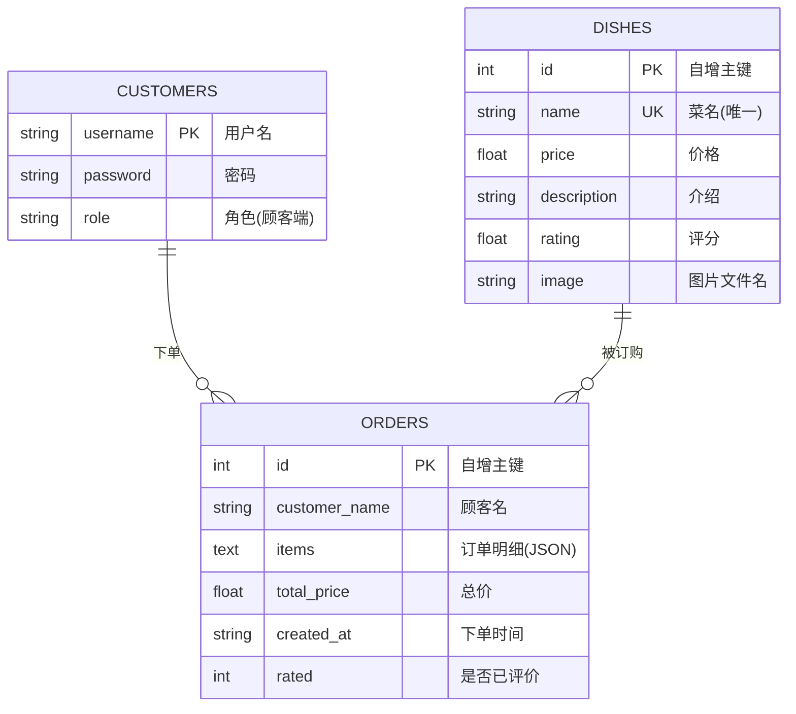
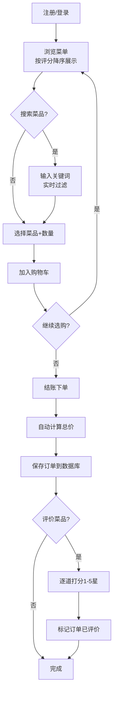

# 《高级程序设计与实践》实践报告

> **题目**：订餐系统（★）  
> **学号**：______  
> **姓名**：______  
> **提交日期**：2026年7月  

---

## 一、项目简介

### 1.1 项目背景

随着外卖行业的快速发展，线上订餐已成为日常生活中不可或缺的一部分。本次实践设计并实现了一个基于 Python 的订餐系统，模拟真实业务场景中的商家管理和顾客点餐流程。系统采用浏览器/服务器（B/S）架构，支持两种角色登录、菜品管理、购物车、自动结账、订单评价等核心功能。

### 1.2 工作概述

项目从零搭建，经历了四个主要迭代阶段：

| 版本 | 主要内容 |
|------|---------|
| v1.0 | Tkinter 桌面 GUI 原型，完成基本 CRUD |
| v2.0 | 重构为 Flask + Bootstrap 网页版，数据层完全复用 |
| v2.1 | 新增菜品搜索、订单历史、评分防重复 |
| v2.2 | 顾客注册、商家锁定、数据隔离 |
| v2.3 | 136 道菜品图片展示、序号重排、商家图片上传 |

### 1.3 最终结果

一个功能完整、界面美观的网页版订餐系统，包含 136 道菜品（含图片），支持商家管理和顾客自助下单、评价。代码采用面向对象设计，数据持久化到 SQLite3 数据库。

---

## 二、项目程序环境构建

### 2.1 运行环境

| 要求 | 说明 |
|------|------|
| 操作系统 | Windows / macOS / Linux |
| Python 版本 | 3.9 及以上 |
| 依赖包 | Flask（`pip install flask`） |
| 数据库 | SQLite3（Python 内置，无需安装） |
| 浏览器 | Chrome / Edge / Firefox 等现代浏览器 |

### 2.2 安装与运行步骤

```bash
# 1. 进入项目目录
cd OrderingSystem

# 2. 创建虚拟环境（可选但推荐）
python -m venv .venv
.venv\Scripts\activate      # Windows
# source .venv/bin/activate # macOS/Linux

# 3. 安装依赖
pip install flask

# 4. 启动服务器
python main.py
```

### 2.3 访问系统

启动后终端显示：
```
* Running on http://127.0.0.1:5000
```

打开浏览器访问 `http://127.0.0.1:5000` 即可进入登录页。

| 角色 | 用户名 | 密码 | 说明 |
|------|--------|------|------|
| 商家 | 商家 | 123456 | 唯一商家，不可注册 |
| 顾客 | 自行注册 | 自定义 | 首次使用需注册 |

---

## 三、详细描述

### 3.1 方案/算法描述

#### 3.1.1 整体架构

系统采用经典的三层架构：

```
┌──────────────────────────────────────────────┐
│                  浏览器                       │
│         (Bootstrap 5 + Jinja2 模板)           │
└──────────────────┬───────────────────────────┘
                   │ HTTP 请求 / 响应
┌──────────────────┴───────────────────────────┐
│               Flask 应用层 (main.py)          │
│  ┌──────────┐ ┌──────────┐ ┌──────────────┐  │
│  │ 登录注册 │ │ 商家管理 │ │  顾客点餐     │  │
│  │ /login   │ │ /business│ │  /customer   │  │
│  │ /register│ │ /api/dish│ │  /api/cart   │  │
│  └──────────┘ └──────────┘ └──────────────┘  │
└──────────────────┬───────────────────────────┘
                   │
┌──────────────────┴───────────────────────────┐
│          数据访问层 (db_utils.py)             │
│  ┌──────────────────────────────────────┐    │
│  │        DatabaseManager 类             │    │
│  │  add_dish / delete_dish / search...  │    │
│  │  save_order / list_orders / rate...  │    │
│  └──────────────────────────────────────┘    │
└──────────────────┬───────────────────────────┘
                   │
┌──────────────────┴───────────────────────────┐
│           SQLite3 (data/ordering.db)          │
│  ┌──────────┐ ┌──────────┐ ┌──────────────┐  │
│  │ dishes   │ │ orders   │ │  customers   │  │
│  └──────────┘ └──────────┘ └──────────────┘  │
└──────────────────────────────────────────────┘
```

#### 3.1.2 数据模型设计（ER 图）



#### 3.1.3 关键业务流程

**顾客点餐流程**：



**评分防重复机制**：`orders` 表设 `rated` 字段（默认 0），评价后更新为 1。订单历史页根据 `rated` 状态决定是否显示"评价"按钮。

### 3.2 实现描述

#### 3.2.1 项目文件结构

```
OrderingSystem/
├── main.py                 # Flask 入口，路由 & API（~230行）
├── models.py               # 数据类 Dish/User/CartItem/Order（~35行）
├── db_utils.py             # 数据库工具类 DatabaseManager（~330行）
├── templates/
│   ├── login.html          # 登录页（Bootstrap 卡片布局）
│   ├── register.html       # 顾客注册页
│   ├── business.html       # 商家端：加菜/删菜/搜索/上传图片
│   └── customer.html       # 顾客端：点餐/购物车/订单历史/评价
├── static/
│   └── images/             # 136 张菜品图片
└── data/
    ├── ordering.db         # SQLite 数据库（自动生成）
    └── .secret_key         # Flask session 密钥（自动生成）
```

#### 3.2.2 核心代码展示

**（1）models.py —— 面向对象数据实体**

使用 Python `dataclass` 定义所有实体类，代码简洁且类型清晰：

```python
from dataclasses import dataclass, field
from typing import List

@dataclass
class Dish:
    """菜品实体，对应数据库 dishes 表"""
    name: str              # 菜名（唯一）
    price: float           # 单价
    description: str       # 介绍
    rating: float = 0.0    # 评分（顾客评价后更新）
    image: str = ""        # 图片文件名
    id: int | None = None  # 数据库自增 ID

@dataclass
class User:
    """用户实体"""
    username: str
    password: str
    role: str              # 商家端 / 顾客端

@dataclass
class CartItem:
    """购物车条目"""
    dish: Dish
    quantity: int = 1

@dataclass
class Order:
    """订单实体"""
    customer_name: str
    items: List[CartItem] = field(default_factory=list)
    total_price: float = 0.0
    created_at: str = ""
    id: int | None = None
```

**（2）db_utils.py —— 数据库初始化与表结构**

```python
class DatabaseManager:
    def __init__(self, db_path: str = "data/ordering.db") -> None:
        self.db_path = db_path
        os.makedirs(os.path.dirname(db_path), exist_ok=True)
        self.connection = sqlite3.connect(
            self.db_path, check_same_thread=False  # Flask 多线程兼容
        )
        self.connection.row_factory = sqlite3.Row
        self.initialize()

    def initialize(self) -> None:
        """建表 + 首次种子数据"""
        with self.connection:
            self.connection.execute("""
                CREATE TABLE IF NOT EXISTS dishes (
                    id INTEGER PRIMARY KEY AUTOINCREMENT,
                    name TEXT NOT NULL UNIQUE,
                    price REAL NOT NULL,
                    description TEXT,
                    rating REAL DEFAULT 0.0,
                    image TEXT DEFAULT ''
                )""")
            self.connection.execute("""
                CREATE TABLE IF NOT EXISTS orders (
                    id INTEGER PRIMARY KEY AUTOINCREMENT,
                    customer_name TEXT NOT NULL,
                    items TEXT NOT NULL,       -- JSON 格式订单明细
                    total_price REAL NOT NULL,
                    created_at TEXT NOT NULL,
                    rated INTEGER DEFAULT 0   -- 0=未评价, 1=已评价
                )""")
            self.connection.execute("""
                CREATE TABLE IF NOT EXISTS customers (
                    username TEXT PRIMARY KEY,
                    password TEXT NOT NULL,
                    role TEXT NOT NULL DEFAULT '顾客端'
                )""")
        # 首次启动导入 136 道菜品
        if self.count_dishes() == 0:
            self.seed_all_dishes()
```

**（3）db_utils.py —— 核心业务操作**

```python
def add_dish(self, dish: Dish) -> Dish:
    """商家添加菜品"""
    with self.connection:
        cursor = self.connection.execute(
            "INSERT INTO dishes (name, price, description, rating, image) "
            "VALUES (?, ?, ?, ?, ?)",
            (dish.name, dish.price, dish.description, dish.rating, dish.image),
        )
    dish.id = cursor.lastrowid
    return dish

def save_order(self, customer_name: str, items: List[CartItem],
               total_price: float) -> int:
    """保存订单——将菜品信息快照存入 JSON"""
    payload = [{
        "dish_id": item.dish.id,
        "dish_name": item.dish.name,     # 快照菜名
        "quantity": item.quantity,
        "unit_price": item.dish.price,   # 快照单价
    } for item in items]
    with self.connection:
        cursor = self.connection.execute(
            "INSERT INTO orders (customer_name, items, total_price, created_at) "
            "VALUES (?, ?, ?, datetime('now'))",
            (customer_name, json.dumps(payload, ensure_ascii=False), total_price),
        )
    return cursor.lastrowid

def search_dishes(self, keyword: str) -> List[Dish]:
    """模糊搜索——支持菜名和介绍"""
    keyword = f"%{keyword}%"
    rows = self.connection.execute(
        "SELECT * FROM dishes WHERE name LIKE ? OR description LIKE ? "
        "ORDER BY rating DESC, name ASC",
        (keyword, keyword),
    ).fetchall()
    return [Dish(id=r["id"], name=r["name"], price=r["price"],
                 description=r["description"], rating=r["rating"],
                 image=r["image"]) for r in rows]
```

**（4）main.py —— 商家添加菜品 API（含图片上传）**

```python
@app.route("/api/dish/add", methods=["POST"])
def api_add_dish():
    """商家添加菜品，支持图片上传"""
    if session.get("role") != "商家端":      # 权限校验
        return jsonify({"ok": False, "msg": "请先登录"})

    name = request.form.get("name", "").strip()
    price_text = request.form.get("price", "").strip()
    description = request.form.get("description", "").strip()

    if not name or not price_text or not description:
        return jsonify({"ok": False, "msg": "请完整填写"})
    try:
        price = float(price_text)
    except ValueError:
        return jsonify({"ok": False, "msg": "价格必须是数字"})

    # 处理图片上传
    image = ""
    file = request.files.get("image")
    if file and file.filename:
        ext = file.filename.rsplit(".", 1)[-1].lower()
        if ext in ("jpg", "jpeg", "png", "gif", "webp"):
            image = f"{uuid.uuid4().hex[:8]}_{file.filename}"
            file.save(os.path.join("static", "images", image))

    get_db().add_dish(Dish(name=name, price=price,
                            description=description, image=image))
    return jsonify({"ok": True})
```

**（5）main.py —— 登录验证（混合模式）**

```python
BUSINESS_ACCOUNT = {"password": "123456", "role": "商家端"}

@app.route("/login", methods=["GET", "POST"])
def login():
    if request.method == "POST":
        username = request.form.get("username", "").strip()
        password = request.form.get("password", "").strip()
        role = request.form.get("role", "")

        if role == "商家端":
            # 商家：硬编码验证，唯一账号
            if username == "商家" and password == BUSINESS_ACCOUNT["password"]:
                session["username"] = username
                session["role"] = role
                return redirect(url_for("business"))
        elif role == "顾客端":
            # 顾客：查询数据库验证
            customer = get_db().validate_customer(username, password)
            if customer:
                session["username"] = username
                session["role"] = role
                return redirect(url_for("customer"))
        return render_template("login.html", error="用户名或密码不正确")
    return render_template("login.html", error="")
```

**（6）templates/business.html —— 菜品列表（序号重排 + 图片）**

```jinja2
<tbody id="dish-table">
  
  <tr>
    <td>{{ loop.index }}</td>              <!-- 行号，删除后自动连续 -->
    <td>
      
    </td>
    <td>{{ d.name }}</td>
    <td>¥{{ "%.2f"|format(d.price) }}</td>
    <td>⭐{{ "%.1f"|format(d.rating) }}</td>
    <td>{{ d.description }}</td>
    <td>
      <button onclick="deleteDish({{ d.id }})">删除</button>
    </td>
  </tr>
  
</tbody>
```

**（7）main.py —— 订单评价 API（评分防重复）**

```python
@app.route("/api/order/<int:order_id>/rate", methods=["POST"])
def api_rate_order(order_id: int):
    if session.get("role") != "顾客端":
        return jsonify({"ok": False, "msg": "请先登录"})
    if get_db().is_order_rated(order_id):         # 已评价则拒绝
        return jsonify({"ok": False, "msg": "该订单已评价"})

    orders = get_db().list_orders()
    order = next((o for o in orders if o["id"] == order_id), None)
    if not order:
        return jsonify({"ok": False, "msg": "订单不存在"})

    # 逐道菜打分
    for item_data in order["items"]:
        rating_text = request.form.get(f'rating_{item_data["dish_id"]}', "")
        if rating_text:
            rating = float(rating_text)
            if 1 <= rating <= 5:
                get_db().update_dish_rating(item_data["dish_id"], rating)

    get_db().mark_order_rated(order_id)            # 标记已评价
    return jsonify({"ok": True})
```

#### 3.2.3 运行结果截图

**（1）登录页面**

登录页采用 Bootstrap 卡片式居中布局，用户选择角色后输入用户名密码。

**（2）商家端-菜品管理**

左侧可添加新菜品（含图片上传），右侧表格展示所有菜品（缩略图 + 序号 + 名称 + 价格 + 评分 + 介绍 + 操作），顶部搜索框支持实时过滤。

**（3）顾客端-点餐页面**

菜单按评分降序排列，每道菜显示缩略图、名称、价格、评分、介绍。可调整数量后加入购物车，右侧购物车实时显示总价。

**（4）顾客端-订单历史**

"我的订单"标签页展示当前用户的所有历史订单，每笔订单显示菜品明细、总价、时间、评价状态。未评价的订单可点击"评价"按钮弹出星级选择弹窗。

**（5）评价弹窗**

Bootstrap Modal 弹窗，每道菜可独立选择 1-5 星评分，提交后该订单标记为"已评价"，按钮消失。

> *注：实际报告需插入对应截图。运行 `python main.py` 后访问 http://127.0.0.1:5000 分别在商家端/顾客端截图即可。*

### 3.3 创新描述

1. **数据层与展示层分离**：`models.py` 和 `db_utils.py` 从 Tkinter 版完整复用到 Flask 版，验证了良好的面向对象分层设计。

2. **订单快照机制**：结账时将菜品名称、价格写入 `orders` 表 JSON 字段，即使商家后续删除或修改菜品，历史订单数据不受影响。

3. **评分防重复**：通过数据库 `rated` 字段控制每笔订单只能评价一次，防止刷分。

4. **序号智能重排**：表格序号使用模板引擎的 `loop.index` 而非数据库自增 ID，删除菜品后序号仍连续。

5. **session 持久化**：Flask 的 `secret_key` 存储到文件，服务器重启后用户无需重新登录。

---

## 四、项目总结

### 4.1 项目概括

本项目实现了一个功能完整、可直接使用的订餐系统，包含两种角色、136 道菜品、完整的点餐-结账-评价流程。技术栈覆盖 Flask Web 框架、SQLite3 数据库、Bootstrap 前端、Jinja2 模板引擎。

### 4.2 个人收获

| 方面 | 收获 |
|------|------|
| **Web 开发** | 掌握了 Flask 路由设计、模板渲染、前后端 AJAX 交互 |
| **数据库** | 实践了 SQLite3 的建表、CRUD、模糊搜索、JSON 字段使用 |
| **面向对象** | 体会了 dataclass 定义实体类 + 方法封装数据操作的设计模式 |
| **调试能力** | 积累了 SQLite 线程安全、Jinja2 变量解析、文件锁等实际问题的排查经验 |
| **工程规范** | 学会了 Git 版本管理、README 文档编写、代码分层组织 |

---

## 五、AI 工具的使用

### 5.1 使用声明

本项目在开发过程中使用了 **GitHub Copilot（基于 DeepSeek V4 Pro 模型）** 作为辅助学习与调试工具，使用范围限于以下场景：

- **调试参考**：遇到报错时，借助 AI 分析错误日志、理解异常原因
- **代码格式**：协助整理 HTML 布局、CSS 样式等重复性工作
- **数据填充**：批量生成 136 道菜品的种子数据（价格由本人核定）
- **文档润色**：README 和实践报告的措辞优化与排版

### 5.2 核心逻辑

关键模块的设计与实现：

| 模块 | 说明 |
|------|------|
| 分层架构设计 | models / db_utils / Flask 三层分离 |
| 登录与权限控制 | 商家硬编码 + 顾客查库 + session 角色校验 |
| 购物车与结账 | Flask session 存储 + 订单 JSON 快照机制 |
| 评分防重复 | `orders.rated` 字段控制，一单一评 |
| 序号重排 | Jinja2 `loop.index` 替代数据库 ID |
| 数据库表设计 | dishes / orders / customers 三表结构 |
| 实践报告 | 方案描述、流程图、架构分析 |

### 5.3 AI 辅助代码标注

根据课程规范，已在以下文件中添加 AI 辅助标注注释：

- `main.py`：AI 辅助调试与格式整理
- `db_utils.py`：AI 辅助批量数据填充与格式整理
- `templates/business.html`：AI 辅助前端布局调试
- `templates/customer.html`：AI 辅助前端交互调试

### 5.4 诚信声明

本人承诺：所有代码均经过逐行阅读与理解，核心业务逻辑由本人独立设计与实现。AI 工具仅用于调试辅助、格式整理和文档润色，未直接生成实验方案、关键数据分析或实践报告结论。
